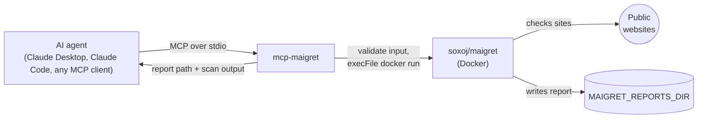

<p align="center">
  <picture>
    <source media="(prefers-color-scheme: dark)" srcset="docs/assets/banner-dark.svg">
    
  </picture>
</p>

<p align="center">
  <a href="https://www.npmjs.com/package/mcp-maigret"></a>
  <a href="https://github.com/w0h1v/mcp-maigret/actions/workflows/ci.yml"></a>
  <a href="LICENSE"></a>
  
  <a href="https://modelcontextprotocol.io"></a>
  <a href="https://smithery.ai/server/mcp-maigret"></a>
</p>

<p align="center">
  <a href="#quickstart">Quickstart</a> ·
  <a href="#tools">Tools</a> ·
  <a href="#output-formats">Formats</a> ·
  <a href="#security">Security</a> ·
  <a href="#troubleshooting">Troubleshooting</a> ·
  <a href="https://w0h1v.github.io/mcp-maigret/">Docs</a>
</p>

**mcp-maigret** is an [MCP](https://modelcontextprotocol.io) server that lets AI agents run [maigret](https://github.com/soxoj/maigret), the OSINT tool that checks a username across thousands of sites. Ask your agent to find where a handle is registered, or to analyze a profile URL, and get a saved report back. Maigret runs in Docker, so there is nothing to install besides Docker and Node.

> [!WARNING]
> Use this for legitimate, authorized OSINT research on publicly available information. Follow the law and each site's terms of service, and respect people's privacy. Some sites rate-limit or block automated lookups.

## Highlights

- **Username search** across hundreds to thousands of sites, filterable by tag (`photo`, `dating`, `us`, ...).
- **URL analysis.** Hand it a profile URL and maigret extracts what it can and looks for linked usernames.
- **Six report formats** (`txt`, `html`, `csv`, `json`, `xmind`, `pdf`), saved to a directory you choose. See [which ones work today](#output-formats).
- **Hardened inputs.** Strict validation and `execFile` with argument arrays. No shell is ever involved. See [Security](#security).
- **Docker-based.** The maigret image is pulled on first use, so every machine runs the same maigret.

## How it works



## Quickstart

**Requirements:** Node.js 18 or newer, and [Docker](https://docs.docker.com/get-docker/) installed and running. Developed and tested on macOS. Linux and Windows (Docker Desktop) should work but are untested.

**1. Pick a reports directory.** The server saves reports here. It is created if missing. The variable is required.

```sh
export MAIGRET_REPORTS_DIR="$HOME/maigret-reports"
```

**2. Add the server to your client.**

<details open>
<summary><strong>Claude Code</strong></summary>

```sh
claude mcp add maigret -e MAIGRET_REPORTS_DIR="$HOME/maigret-reports" -- npx -y mcp-maigret
```

</details>

<details open>
<summary><strong>Claude Desktop</strong></summary>

Edit the config file (macOS: `~/Library/Application Support/Claude/claude_desktop_config.json`, Windows: `%APPDATA%\Claude\claude_desktop_config.json`), then restart Claude Desktop:

```json
{
  "mcpServers": {
    "maigret": {
      "command": "npx",
      "args": ["-y", "mcp-maigret"],
      "env": { "MAIGRET_REPORTS_DIR": "/absolute/path/to/maigret-reports" }
    }
  }
}
```

</details>

<details>
<summary><strong>Smithery</strong></summary>

```sh
npx -y @smithery/cli install mcp-maigret --client claude
```

</details>

<details>
<summary><strong>From source</strong></summary>

```sh
git clone https://github.com/w0h1v/mcp-maigret && cd mcp-maigret
npm install && npm run build
```

Then point your client at `node /absolute/path/to/mcp-maigret/build/index.js` with the same `MAIGRET_REPORTS_DIR` variable.

</details>

**3. Try it.** Ask your agent: *"Use maigret to check where the username `octocat` is registered, filtered to the `coding` tag."*

The first search pulls the maigret image (about 800 MB), so it takes longer.

## Tools

### `search_username`

Search for a username across social networks and sites.

| Parameter | Type | Default | Description |
|---|---|---|---|
| `username` | string, required | | Letters, digits, `_`, `-` and `.` only, up to 100 characters |
| `format` | enum | `txt` | `txt`, `html`, `csv`, `json`, `xmind` or `pdf` (see [formats](#output-formats)) |
| `use_all_sites` | boolean | `false` | Check all sites in maigret's database instead of the top 500 |
| `tags` | string[] | none | Only check sites with these tags. Letters, digits, `_` and `-` only |

```json
{ "username": "octocat", "format": "html", "tags": ["coding"] }
```

The result contains the path of the saved report and maigret's console output. If the report file was not produced, the result says so instead of reporting success.

### `parse_url`

Parse a URL to extract information and search for associated usernames.

| Parameter | Type | Default | Description |
|---|---|---|---|
| `url` | string, required | | An `http` or `https` URL without shell metacharacters |
| `format` | enum | `txt` | Same options as above |

```json
{ "url": "https://github.com/octocat" }
```

Results come back as maigret's scan output text.

## Output formats

Reports are written to `MAIGRET_REPORTS_DIR`. Maigret picks the file names, and for some formats it adds a suffix. When maigret finds related usernames it can write extra reports next to the main one (for example `report_octocatsup.txt`).

| Format | File written by `search_username` | Status |
|---|---|---|
| `txt` | `report_<username>.txt` | Works. Default. |
| `csv` | `report_<username>.csv` | Works |
| `json` | `report_<username>_simple.json` | Works |
| `html` | `report_<username>_plain.html` | Works |
| `xmind` | `report_<username>.xmind` | Works |
| `pdf` | `report_<username>.pdf` | **Not available** with the stock image. Maigret needs its optional `pdf` extra, which `soxoj/maigret` doesn't include. The tool reports that no file was produced. |

Statuses were checked against maigret 0.6.6 (image `soxoj/maigret:latest`, October 2026). Maigret's command line changes between releases, so this can drift.

## Security

Usernames, URLs and tags come from an AI agent and are treated as untrusted.

- **Validation.** Usernames allow only `[A-Za-z0-9_.-]` (max 100 characters). Tags allow only `[A-Za-z0-9_-]` (max 50). URLs must parse as `http` or `https` and may not contain shell metacharacters.
- **No shell.** Docker is launched with `execFile` and an argument array, never a concatenated command string.
- **Contained writes.** Reports are written by the container into the single directory you mount. The server does not read or write elsewhere.

What this does not cover: the server runs Docker on your machine on your agent's behalf, and it makes network requests to many third-party sites from your IP address. Run it only for agents and clients you trust.

Found a vulnerability? Report it privately. See [SECURITY.md](SECURITY.md).

## Troubleshooting

| Message | Fix |
|---|---|
| `Docker is not installed or not running` | Install Docker and start the daemon. Check with `docker --version` and `docker ps`. On Linux, add yourself to the `docker` group: `sudo usermod -aG docker $USER`. |
| `MAIGRET_REPORTS_DIR environment variable must be set` | Add the variable to your client's `env` block, then restart the client. |
| `Error creating reports directory` | Check the path and that your user can write to it. Use an absolute path without a trailing slash. |
| `Invalid username` / `Invalid tag` / `Invalid URL` | Input failed validation. Use only the characters listed under [Tools](#tools). |
| `No report file was produced ...` | The chosen format isn't available in the image (see [formats](#output-formats)). Try `txt`, `json` or `html`. |
| `Error executing maigret` | Read the Docker output included in the message. Often a network problem or a changed maigret option. |
| Searches seem slow | The first run pulls the image. Narrow the search with `tags`, and avoid `use_all_sites` unless you need it. |

More in the [docs](https://w0h1v.github.io/mcp-maigret/troubleshooting/).

## Contributing

Contributions are welcome. Start with [CONTRIBUTING.md](CONTRIBUTING.md).

- [Changelog](CHANGELOG.md)
- Questions and help: [SUPPORT](.github/SUPPORT.md)
- Security reports: [SECURITY.md](SECURITY.md) (private advisories, never public issues)

<a href="https://glama.ai/mcp/servers/knnpcz651x"></a>

## License

[MIT](LICENSE). Independent project, not affiliated with the maigret project. Maigret is by [soxoj](https://github.com/soxoj/maigret) and has its own license.
